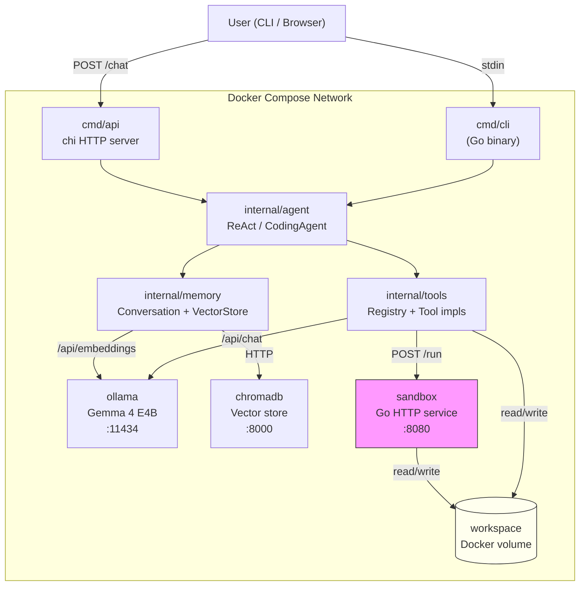

# Homunculus

```text
   00                                              000  
     00000000                              00000000     
          0000                            0000          
          0   0 0                      0     0          
        0         00000000000000000         0           
  000    000 000000000000000000000000000 00    0        
    000000000000000000000000000000000000000000          
 000   00000000000000000000000000000000000000 000       
     0000000000000000               0000000000          
     0000000000000         0           00000000         
    0   00  0000          0000           0000000        
    00000   000         0000000           000000        
    00000 0  000   00   0      0  00       000000       
    0000  0   0      00          0         000000       
          00        0000        0000       00000        
          000     00000000    00000000    000000        
           000                           000000         
            0000           00          000000           
              000000               00000000             
                 00000000000000000000000                
                      0 00000000 0                      
```

Homunculus is a learning-first project that builds a coding AI agent from first principles. It grows through six iterative phases — from a raw HTTP call to a local language model all the way to a self-correcting coding agent that can write, run, and debug code autonomously. Every concept is built by hand before any framework abstracts it away.

**Primary language:** Go. Strong typing and compilation make the agent's internals — tool interfaces, typed API structs, parsed response types — self-documenting and compiler-verified. Python appears only where the ecosystem forces it: inside the code execution sandbox, and in the optional Streamlit UI.

**Base model:** Gemma 4 E4B, served locally via [Ollama](https://ollama.com). No external API calls, no usage costs, full control over model parameters.

**Infrastructure:** Every dependency runs in a Docker container. `docker compose up` is the only command needed to go from zero to a running agent.

---

## Architecture Overview

The diagram below shows the full system as it exists at the end of Phase 5. Earlier phases use a subset of these services.



**Service responsibilities:**

| Service | Language | Role |
|---------|----------|------|
| `ollama` | — | Serves Gemma 4 E4B over HTTP; also provides embeddings via `nomic-embed-text` |
| `cmd/cli` | Go | Interactive terminal interface (Phases 1–3) |
| `cmd/api` | Go | REST API wrapping the agent (Phase 4+) |
| `internal/agent` | Go | ReAct loop, response parser, coding agent loop |
| `internal/tools` | Go | Tool interface, registry, all tool implementations |
| `internal/memory` | Go | Conversation history (sliding window), ChromaDB wrapper |
| `sandbox` | Go + Python | Isolated code execution — no network, memory/CPU capped |
| `chromadb` | — | Persists embeddings for long-term memory (Phase 4+) |

---

## Prerequisites

- **Docker Desktop** with Compose V2 (`docker compose version` should show v2.x)
- **8 GB RAM minimum** — Gemma 4 E4B model weights are approximately 9.6 GB on disk; 16 GB recommended for comfortable operation alongside other applications
- **Go 1.23+** — for running/building outside Docker during development
- **Git**

Check your setup:

```bash
docker compose version    # should print v2.x.x
go version                # should print go1.23 or later
```

### GPU support (optional but recommended)

The `docker-compose.yml` already includes NVIDIA GPU passthrough. To activate it:

1. Install the latest **NVIDIA Game Ready or Studio drivers** for your GPU
2. On Windows, Docker Desktop with the **WSL2 backend** picks up NVIDIA drivers automatically — no extra steps needed
3. On Linux, install the **NVIDIA Container Toolkit**:
   ```bash
   curl -fsSL https://nvidia.github.io/libnvidia-container/gpgkey | sudo gpg --dearmor -o /usr/share/keyrings/nvidia-container-toolkit-keyring.gpg
   sudo apt-get install -y nvidia-container-toolkit
   sudo nvidia-ctk runtime configure --runtime=docker
   sudo systemctl restart docker
   ```
4. Verify Docker can see your GPU: `docker run --rm --gpus all nvidia/cuda:12.0-base nvidia-smi`

If you don't have an NVIDIA GPU or prefer CPU-only, remove the `deploy:` block from the `ollama` service in `docker-compose.yml`. Inference will be slower but fully functional.

**AMD GPU (ROCm):** Replace `image: ollama/ollama:latest` with `image: ollama/ollama:rocm` and change `driver: nvidia` to `driver: amdgpu`.

---

## Quick Start (Phase 1)

This gets you from zero to a working conversation with Gemma 4 E4B.

```bash
# 1. Clone the repository
git clone https://github.com/your-username/homunculus.git
cd homunculus

# 2. Copy the environment file
#    Edit .env to override any defaults (see Configuration section)
cp .env.example .env

# 3. Start Ollama and pull the model
#    The model-puller service runs once, pulls gemma4:e4b, then exits.
#    This takes 5-15 minutes on the first run depending on your connection.
#    Weights are stored in the ollama_data volume and persist across restarts.
docker compose up ollama model-puller

# 4. Verify the model is available
curl http://localhost:11434/api/tags | grep gemma4

# 5. Run the CLI (builds the Go binary inside Docker)
docker compose run --rm cli

# You should see a prompt. Type a message and press Enter:
# > Say hello in one sentence.
# Hello! I'm Gemma, ready to help you today.
```

What just happened:
- Docker Compose created a bridge network so services can reach each other by name (e.g., `http://ollama:11434`)
- The `ollama_data` volume stored the model weights so the pull won't repeat on next startup
- The Go `OllamaClient` sent a raw `POST /api/chat` request — no SDK, just `net/http` and typed structs

---

## Development Tools

Day-to-day development uses [Task](https://taskfile.dev) for common commands and `golangci-lint` for static analysis.

### Install

```bash
# Task runner
go install github.com/go-task/task/v3/cmd/task@latest

# golangci-lint (linter aggregator)
go install github.com/golangci/golangci-lint/cmd/golangci-lint@latest
```

### Available commands

Both `task` and `make` are supported — they run the same underlying commands.

| Task | Make | Description |
|------|------|-------------|
| `task build` | `make build` | Compile CLI binary to `build/homunculus` |
| `task run` | `make run` | Run CLI locally (needs Ollama on `localhost:11434`) |
| `task test` | `make test` | Run unit tests (skips integration tests) |
| `task test:integration` | `make test-integration` | Run integration tests against live Ollama |
| `task lint` | `make lint` | Run `golangci-lint` |
| `task clean` | `make clean` | Remove `build/` directory |

### Typical development loop

```bash
# 1. Start Ollama in the background (GPU-accelerated if drivers are installed)
docker compose up ollama -d

# 2. Edit source files, then run locally without rebuilding Docker images
task run

# 3. Run tests before committing
task test

# 4. Check for lint issues
task lint
```

`task run` sets `OLLAMA_BASE_URL=http://localhost:11434` and `PROMPTS_DIR=./prompts` automatically, so you can edit `prompts/system.txt` and re-run without touching env vars.

---

## Project Phases

| Phase | Title | Status | Key Concept |
|-------|-------|--------|-------------|
| [1](#phase-1--foundation-ollama--gemma-4-e4b--go-client) | Foundation | IN PROGRESS | Raw HTTP client, Docker Compose |
| [2](#phase-2--react-loop-reasoning--acting-from-scratch) | ReAct Loop | TODO | Agents are just a loop + a prompt + a parser |
| [3](#phase-3--tool-expansion-code-sandbox--file-operations) | Tool Expansion | TODO | Docker as a security primitive |
| [4](#phase-4--memory-conversation-history--vector-store) | Memory | TODO | Statelessness, embeddings, ChromaDB |
| [5](#phase-5--coding-agent-write-run-debug-iterate) | Coding Agent | TODO | Self-correction, test-driven loops |
| [6](#phase-6--advanced-stretch-planning-self-reflection-multi-agent) | Advanced | TODO | Planning, Reflexion, multi-agent |

Update the Status column as you complete each phase: `TODO` → `IN PROGRESS` → `COMPLETE`.

---

## Phase 1 — Foundation: Ollama + Gemma 4 E4B + Go Client

### What you will learn

- The Ollama HTTP API: `/api/chat`, `/api/pull`, `/api/tags`, `/api/embeddings`
- What a chat completion request actually contains: `model`, `messages`, `stream`, `options`
- What model parameters do: `temperature` (randomness), `top_p` (nucleus sampling), `num_ctx` (context window size in tokens)
- Docker Compose networking: service names as hostnames, health checks, volume persistence
- Go's `net/http` package for making typed HTTP requests and decoding JSON responses

### What you will build

**`internal/ollama/client.go`**

The `Client` struct is the only way the rest of the codebase talks to Ollama. By building it with raw `net/http` rather than the Ollama Go SDK, you see exactly what the SDK hides.

```go
type Client struct {
    BaseURL    string
    HTTPClient *http.Client
}

type Message struct {
    Role    string `json:"role"`
    Content string `json:"content"`
}

type ChatRequest struct {
    Model    string    `json:"model"`
    Messages []Message `json:"messages"`
    Stream   bool      `json:"stream"`
    Options  Options   `json:"options,omitempty"`
}

type Options struct {
    Temperature float64 `json:"temperature,omitempty"`
    NumCtx      int     `json:"num_ctx,omitempty"`
}

type ChatResponse struct {
    Message Message `json:"message"`
    Done    bool    `json:"done"`
}

func (c *Client) Chat(ctx context.Context, req ChatRequest) (string, error)
func (c *Client) ChatStream(ctx context.Context, req ChatRequest, fn func(chunk string)) error
```

**`docker-compose.yml`** (Phase 1 services only):

```yaml
services:
  ollama:
    image: ollama/ollama:latest
    volumes:
      - ollama_data:/root/.ollama
    ports:
      - "11434:11434"
    healthcheck:
      test: ["CMD", "curl", "-f", "http://localhost:11434/api/tags"]
      interval: 10s
      timeout: 5s
      retries: 10

  model-puller:
    image: curlimages/curl:latest
    depends_on:
      ollama:
        condition: service_healthy
    command: >
      curl -X POST http://ollama:11434/api/pull
      -d '{"model":"gemma4:e4b"}'
    restart: "no"

  cli:
    build: .
    depends_on:
      ollama:
        condition: service_healthy
    environment:
      - OLLAMA_BASE_URL=http://ollama:11434
      - MODEL_NAME=gemma4:e4b
    stdin_open: true
    tty: true

volumes:
  ollama_data:
```

The `model-puller` is a one-shot container. It runs, pulls the model into the shared `ollama_data` volume, and exits. On subsequent `docker compose up` runs, Ollama finds the weights already present and skips the pull. This makes the setup declarative and reproducible.

### How to run

```bash
docker compose up ollama model-puller   # wait for pull to complete
docker compose run --rm cli             # start interactive session
```

### How to verify

```bash
# Unit test (no Docker needed — mocks the HTTP server)
go test ./internal/ollama/... -v

# Integration test (requires Ollama running)
OLLAMA_BASE_URL=http://localhost:11434 go test ./internal/ollama/... -v -run Integration
```

Pass criteria: `Chat()` returns a non-empty string. `ChatStream()` calls the callback function at least once with non-empty content.

---

## Phase 2 — ReAct Loop: Reasoning + Acting from Scratch

### What you will learn

- What a ReAct loop actually is: a structured text format enforced by the prompt, a parser that extracts intent from that text, and a `for` loop that keeps calling the model until it's done
- There is no magic: "tool calling" in every agent framework is structured text parsing underneath
- How a tool registry works: a map from string names to typed implementations
- How prompt engineering defines agent behavior — the system prompt IS the agent's architecture
- How to handle a stuck agent: max iterations, identical-output detection, forced termination

### What you will build

The ReAct format is a contract between your prompt and your parser:

```
Thought: I need to calculate the area of a circle with radius 5.
Action: calculator
Action Input: 3.14159 * 5 * 5
Observation: 78.53975

Thought: I have the answer.
Final Answer: The area is approximately 78.54 square units.
```

Your code enforces this contract by:
1. Injecting the format definition into the system prompt
2. Parsing each model response for `Thought:`, `Action:`, `Action Input:`, or `Final Answer:`
3. When `Action:` is found, looking up the tool in the registry, calling `Run()`, and appending `Observation: <result>` to the message history
4. When `Final Answer:` is found, returning it and stopping
5. When neither is found (malformed output), injecting an error observation and retrying

**`internal/tools/tool.go`**

```go
// Tool is the interface every tool must implement.
// Name and Description are injected into the system prompt automatically.
// Run receives the raw "Action Input" string and returns a result or error.
type Tool interface {
    Name() string
    Description() string
    Run(ctx context.Context, input string) (string, error)
}
```

The compiler enforces this contract. If `calculator.go` forgets to implement `Description()`, the build fails — you find out at compile time, not when the agent calls a tool at runtime.

**`internal/agent/parser.go`**

```go
type ResponseType string

const (
    TypeAction      ResponseType = "action"
    TypeFinalAnswer ResponseType = "final"
    TypeMalformed   ResponseType = "malformed"
)

type ParsedResponse struct {
    Type   ResponseType
    Tool   string
    Input  string
    Answer string
}

func ParseResponse(text string) ParsedResponse
```

**`internal/agent/react.go`**

```go
type ReActAgent struct {
    Client        *ollama.Client
    Registry      *tools.Registry
    MaxIterations int
    Model         string
    SystemPrompt  string
}

func (a *ReActAgent) Run(ctx context.Context, query string) (string, error)
```

**`internal/tools/calculator.go`** — Uses the `govaluate` library for safe expression evaluation. Never `eval()`. The model's input is untrusted text; passing it to a math parser limits the blast radius.

**`internal/tools/websearch.go`** — Calls DuckDuckGo's instant answer JSON endpoint. No API key required. Returns the top 3 results as formatted text (title, URL, snippet).

### How to run

```bash
docker compose run --rm cli
# > What is 1337 multiplied by 42?
# Thought: I need to multiply 1337 by 42.
# Action: calculator
# Action Input: 1337 * 42
# Observation: 56154
# Final Answer: 1337 × 42 = 56,154.
```

### How to verify

Manually test three query types:
1. Math query → agent invokes `calculator`, uses result in final answer
2. Current events query → agent invokes `web_search`, cites source in final answer
3. Factual query with known answer → agent answers directly without invoking any tool

Inspect the logs: every `Thought`, `Action`, `Action Input`, and `Observation` should appear. The loop count should be visible. Any malformed responses should trigger a retry with an error observation.

---

## Phase 3 — Tool Expansion: Code Sandbox + File Operations

### What you will learn

- Why you must never execute model-generated code in your main process — the model's output is untrusted input
- How Docker works as a security primitive: a container is an isolation boundary, not just a packaging format
- Docker resource limits: `--memory`, `--cpus`, execution timeouts via `exec.CommandContext`
- Network isolation: `internal: true` on a Docker network means containers on it have no external internet access
- Path traversal attacks: why `filepath.Clean` alone is insufficient and how to validate that a resolved path stays within a root directory

### What you will build

The sandbox is a separate Go HTTP service. The agent never executes code directly — it sends code to the sandbox over HTTP and receives structured output back. If the model generates malicious code, it is confined to the sandbox container, which has no network, limited memory, and a hard execution timeout.

```
Agent container  →  POST /run {"code": "...", "language": "python", "timeout_secs": "10"}
                 ←  {"stdout": "...", "stderr": "...", "exit_code": 0, "timed_out": false}
```

**`sandbox/main.go`**

```go
type RunRequest struct {
    Code        string `json:"code"`
    Language    string `json:"language"`
    TimeoutSecs int    `json:"timeout_secs"`
}

type RunResult struct {
    Stdout   string `json:"stdout"`
    Stderr   string `json:"stderr"`
    ExitCode int    `json:"exit_code"`
    TimedOut bool   `json:"timed_out"`
}
```

The sandbox uses `exec.CommandContext` with a derived context that cancels after `TimeoutSecs`. If the context deadline is exceeded, `TimedOut` is set to `true` in the response — the agent can then tell the user the code ran too long rather than hanging forever.

**`sandbox/Dockerfile`** — Multi-stage build: compile the Go binary in a builder stage, copy it into a minimal `python:3.12-slim` image (slim because the sandbox needs Python to run agent-written code). The final image has no Go toolchain, no package manager access at runtime.

**Docker Compose additions:**

```yaml
  sandbox:
    build: ./sandbox
    networks:
      - agent-net
      - sandbox-internal   # no external internet
    deploy:
      resources:
        limits:
          cpus: "0.5"
          memory: 256M
    volumes:
      - workspace:/workspace

networks:
  sandbox-internal:
    internal: true   # containers here cannot reach the internet
```

**`internal/tools/fileops.go`** — All file paths are validated against the workspace root:

```go
func safePath(root, userPath string) (string, error) {
    abs := filepath.Join(root, userPath)
    clean := filepath.Clean(abs)
    if !strings.HasPrefix(clean, filepath.Clean(root)+string(os.PathSeparator)) {
        return "", fmt.Errorf("path escapes workspace root: %s", userPath)
    }
    return clean, nil
}
```

### How to run

```bash
docker compose up ollama sandbox
docker compose run --rm cli
# > Write a Python function that checks if a number is prime, then test it with 17 and 4.
```

### How to verify

```bash
# Test sandbox directly
curl -X POST http://localhost:8080/run \
  -H "Content-Type: application/json" \
  -d '{"code":"print(2 + 2)","language":"python","timeout_secs":5}'
# Expected: {"stdout":"4\n","stderr":"","exit_code":0,"timed_out":false}

# Test timeout enforcement
curl -X POST http://localhost:8080/run \
  -d '{"code":"import time; time.sleep(30)","language":"python","timeout_secs":2}'
# Expected: {"timed_out":true}

# Test path traversal prevention (Go unit test)
go test ./internal/tools/... -run TestSafePath -v
```

---

## Phase 4 — Memory: Conversation History + Vector Store

### What you will learn

- Why LLMs are stateless: there is no hidden memory between API calls. The only "memory" is the `messages` array you send each time
- The context window problem: conversation history grows until it exceeds `num_ctx` tokens (Gemma 4 E4B supports 128K tokens, but code + reasoning traces consume this fast)
- Sliding window vs. summarization strategies for managing context growth
- What an embedding is: a fixed-length vector of floats that encodes semantic meaning, produced by a second model (`nomic-embed-text`)
- Cosine similarity: why two vectors with a small angle between them represent similar meaning
- ChromaDB: stores vectors alongside metadata, retrieves by similarity

### What you will build

Two kinds of memory:

**Short-term (conversation history)** — `internal/memory/conversation.go`

Wraps a slice of `Message` with a configurable `MaxMessages` window. When the limit is exceeded, the oldest messages (excluding the system prompt) are summarized by the LLM into a single condensed system message. This teaches you the summarization memory pattern used by production agents.

```go
type ConversationHistory struct {
    messages    []ollama.Message
    maxMessages int
    client      *ollama.Client
    model       string
}

func (h *ConversationHistory) Add(role, content string)
func (h *ConversationHistory) Messages() []ollama.Message
func (h *ConversationHistory) MaybeSummarize(ctx context.Context) error
```

**Long-term (vector store)** — `internal/memory/vectorstore.go`

Calls Ollama's `/api/embeddings` endpoint to convert text into a vector, then stores that vector in ChromaDB. On recall, the query text is embedded and ChromaDB returns the most similar stored vectors.

```go
type VectorStore struct {
    chromaURL  string
    ollamaURL  string
    embedModel string
    collection string
}

func (vs *VectorStore) Store(ctx context.Context, text string, meta map[string]string) error
func (vs *VectorStore) Query(ctx context.Context, text string, n int) ([]string, error)
```

Two new tools — `remember` and `recall` — wrap these methods and make them accessible to the agent.

**`cmd/api/main.go`** — Introduces the HTTP API (replaces bare CLI for external access):

- `POST /chat` — sends a message, maintains session history, returns response
- `GET /memory/search?q=<query>` — searches long-term memory
- `DELETE /memory` — clears ChromaDB collection

Uses the `chi` router for clean route registration and middleware support.

### How to run

```bash
docker compose up
curl -X POST http://localhost:8080/chat \
  -H "Content-Type: application/json" \
  -d '{"message": "My name is Alex and I work on distributed systems."}'

docker compose restart api   # clear in-memory conversation state

curl -X POST http://localhost:8080/chat \
  -d '{"message": "What do you know about me?"}'
# Should recall "Alex" and "distributed systems" from ChromaDB
```

### How to verify

1. Short-term memory: send 25+ messages in one session, verify older messages are summarized (check logs for summarization event)
2. Long-term memory: store a fact, restart the `api` container, query for the fact — it should be retrieved from ChromaDB
3. Embedding sanity check: `GET /memory/search?q=distributed+systems` should return the message about Alex

---

## Phase 5 — Coding Agent: Write, Run, Debug, Iterate

### What you will learn

- How to specialize a general agent for a domain using only prompt engineering — no new architecture required
- The test-driven agent pattern: tests as the objective function the agent minimizes
- Self-correction loops: how an agent can observe its own failures and reason about fixes
- Prompt chaining: using one LLM call's output as structured input to the next (plan → implement → verify)
- Identical-failure detection: how to break out of loops where the agent keeps making the same mistake

### What you will build

The coding agent adds a plan→write→test→debug loop on top of the Phase 2 ReAct agent:

```
receive task + optional existing code + test file path
│
└─► [Plan]  LLM reads task + any prior test failures → produces implementation plan
    │
    └─► [Write]  LLM writes/modifies code → saved to workspace via WriteCode tool
        │
        └─► [Test]  RunTests tool → runs pytest in sandbox → parses output
            │
            ├─► all tests pass → return success + final code
            ├─► tests fail, new failure → go to Plan with failure context
            ├─► tests fail, identical failure as last attempt → inject "you are stuck" prompt, try once more
            └─► max_attempts reached → return partial result + full debug trace
```

**`internal/agent/coding.go`**

```go
type TestRun struct {
    Attempt  int
    Passed   int
    Failed   int
    Output   string
}

type CodingAgent struct {
    ReActAgent
    MaxAttempts int
    testHistory []TestRun
}

func (a *CodingAgent) Run(ctx context.Context, task, existingCode, testFile string) (string, error)
```

**`internal/tools/codetools.go`** — Key tools:

- `WriteCode(filename, content string)` — validates Python syntax (`python3 -c "import ast,sys;ast.parse(sys.stdin.read())"` via sandbox) before writing to workspace; syntax errors are returned as tool errors so the agent can fix them before writing
- `RunTests(testFile string)` — runs `pytest <file> -v --tb=short` in sandbox, parses the output into a `TestResult` struct with `Passed`, `Failed`, and `FailureMessages`
- `LintCode(filename string)` — runs `ruff check <file>` in sandbox, returns issues

**`prompts/coding_agent.txt`** — The specialized system prompt instructs the model to:
- Never use markdown code fences in code output (raw code only, so `WriteCode` can save it directly)
- Always run tests after writing code
- Read test failures carefully before attempting a fix
- Declare a plan before writing any code

**`ui/app.py`** (optional) — Streamlit interface with live streaming of Thought/Action/Observation steps and syntax-highlighted final code. Python is acceptable here — no Go equivalent is this fast to prototype.

### How to run

```bash
docker compose up

# Greenfield task
curl -X POST http://localhost:8080/code \
  -d '{
    "task": "Write a function is_palindrome(s: str) -> bool that ignores case and spaces.",
    "test_file": "tests/test_palindrome.py"
  }'
```

### How to verify

Three benchmark tasks (also used as integration tests in `tests/integration/`):

1. **Greenfield** — provide a task description and a test file; agent must write code that passes all tests
2. **Bug fix** — provide a broken implementation and tests; agent must identify and fix the bugs
3. **Refactor** — provide working but inefficient code and tests; agent must optimize while keeping all tests green

Pass criteria: all three tasks complete within `MaxAttempts`, all tests pass in the final attempt.

---

## Phase 6 — Advanced (Stretch): Planning, Self-Reflection, Multi-Agent

This phase is deliberately open-ended. It is a research and experimentation phase — the goal is to explore frontier patterns, not to follow a fixed spec.

### Concepts to explore

**Reflexion (self-critique)** — Before the agent commits code, a second LLM call critiques the implementation: "What edge cases might this miss? What could go wrong?" The agent then decides whether to revise or submit. Implemented as a `reflect` tool.

**Hierarchical planning** — For large tasks ("Build a REST API that does X"), a planner agent decomposes the task into subtasks. Each subtask is executed by a worker agent. Results are aggregated. The planner and worker agents communicate through the `cmd/api` HTTP layer — no special framework needed.

**LangGraph introduction** — By this point, `internal/agent/coding.go` is complex enough that LangGraph's `StateGraph` abstraction becomes genuinely useful. Port the Phase 5 coding agent to LangGraph, then compare: what did the framework add? What did it hide? Was the trade-off worth it?

**Multi-agent via Docker**

```yaml
  agent-planner:
    build: .
    environment:
      - AGENT_ROLE=planner
      - WORKER_URLS=http://agent-worker-1:8080,http://agent-worker-2:8080

  agent-worker-1:
    build: .
    environment:
      - AGENT_ROLE=worker
      - SPECIALIZATION=python_backend

  agent-worker-2:
    build: .
    environment:
      - AGENT_ROLE=worker
      - SPECIALIZATION=testing
```

---

## Running a Specific Phase

The `scripts/run_phase.sh` script starts only the Docker services needed for a given phase:

```bash
./scripts/run_phase.sh 1   # ollama + model-puller + cli
./scripts/run_phase.sh 2   # phase 1 + agent service
./scripts/run_phase.sh 3   # phase 2 + sandbox
./scripts/run_phase.sh 4   # phase 3 + chromadb + api
./scripts/run_phase.sh 5   # all services + optional ui
```

This is useful when working on an early phase without waiting for ChromaDB or the sandbox to start.

---

## Tool Reference

| Tool | Description | Input | Output |
|------|-------------|-------|--------|
| `calculator` | Evaluates a math expression safely | Expression string, e.g. `"3.14 * 5 * 5"` | Numeric result as string |
| `web_search` | Searches the web via DuckDuckGo | Search query string | Top 3 results: title, URL, snippet |
| `run_code` | Executes code in the isolated sandbox | JSON: `{"code": "...", "language": "python"}` | stdout, stderr, exit code, timed_out flag |
| `read_file` | Reads a file from the workspace | Relative file path | File contents as string |
| `write_file` | Writes content to a workspace file | JSON: `{"path": "...", "content": "..."}` | Confirmation or error |
| `list_files` | Lists workspace directory contents | Relative directory path (or `.` for root) | Formatted directory tree |
| `write_code` | Validates syntax then writes code | JSON: `{"filename": "...", "content": "..."}` | Confirmation or syntax error |
| `run_tests` | Runs pytest on a test file | Relative path to test file | Pass/fail counts and failure messages |
| `lint_code` | Runs ruff linter on a file | Relative file path | List of issues or "no issues found" |
| `remember` | Stores a fact in long-term memory | Text to remember | Confirmation |
| `recall` | Retrieves relevant memories | Query string | Top matching stored facts |

---

## Configuration

All configuration is read from environment variables. Copy `.env.example` to `.env` and edit as needed.

| Variable | Default | Description |
|----------|---------|-------------|
| `OLLAMA_BASE_URL` | `http://ollama:11434` | Ollama service URL. Change to `http://localhost:11434` if running the agent outside Docker. |
| `MODEL_NAME` | `gemma4:e4b` | The Ollama model to use for chat. Must be pulled first. |
| `EMBED_MODEL_NAME` | `nomic-embed-text` | The Ollama model to use for embeddings. Pulled separately. |
| `AGENT_MAX_ITERATIONS` | `10` | Max ReAct loop iterations before giving up. |
| `AGENT_MAX_ATTEMPTS` | `5` | Max coding attempts before returning partial result (Phase 5). |
| `CONVERSATION_MAX_MESSAGES` | `20` | Messages retained in sliding window before summarization triggers. |
| `SANDBOX_URL` | `http://sandbox:8080` | Sandbox service URL. |
| `SANDBOX_DEFAULT_TIMEOUT` | `10` | Default code execution timeout in seconds. |
| `CHROMA_URL` | `http://chroma:8000` | ChromaDB service URL. |
| `CHROMA_COLLECTION` | `homunculus` | ChromaDB collection name for long-term memory. |
| `API_PORT` | `8080` | Port for the `cmd/api` HTTP server. |
| `WORKSPACE_ROOT` | `/workspace` | Absolute path to the shared workspace volume inside containers. |
| `LOG_LEVEL` | `info` | Logging level: `debug`, `info`, `warn`, `error`. Set to `debug` to see every Thought/Action/Observation. |

---

## Testing

Go tests live alongside source files as `_test.go` files. Integration tests (requiring running Docker services) live in `tests/integration/`.

```bash
# Unit tests — no Docker required
go test ./... -short -v

# Integration tests for a specific phase — requires relevant services running
INTEGRATION=1 go test ./tests/integration/... -run Phase1 -v
INTEGRATION=1 go test ./tests/integration/... -run Phase2 -v
INTEGRATION=1 go test ./tests/integration/... -run Phase3 -v
INTEGRATION=1 go test ./tests/integration/... -run Phase4 -v
INTEGRATION=1 go test ./tests/integration/... -run Phase5 -v

# All integration tests
docker compose up -d
INTEGRATION=1 go test ./tests/integration/... -v -timeout 5m

# Run with race detector (important for the streaming client)
go test ./... -race -short
```

Integration tests are guarded by `if os.Getenv("INTEGRATION") == ""  { t.Skip() }` so they are skipped in normal `go test ./...` runs and only run when explicitly enabled.

---

## Project Structure

```
homunculus/
├── docker-compose.yml          # All services; use run_phase.sh to start a subset
├── .env.example                # Environment variable template with descriptions
├── Dockerfile                  # Builds the main agent binary (cli + api)
├── go.mod                      # Go module: github.com/your-username/homunculus
├── go.sum
│
├── cmd/
│   ├── cli/
│   │   └── main.go             # Phase 2+: interactive terminal (bufio.Scanner loop)
│   └── api/
│       └── main.go             # Phase 4+: HTTP API server entrypoint
│
├── internal/                   # Private packages — not importable by external code
│   ├── ollama/
│   │   ├── client.go           # Phase 1: typed Ollama HTTP client
│   │   └── client_test.go
│   ├── agent/
│   │   ├── react.go            # Phase 2: ReAct loop engine
│   │   ├── react_test.go
│   │   ├── parser.go           # Typed response parser (ParsedResponse struct)
│   │   ├── parser_test.go
│   │   ├── coding.go           # Phase 5: CodingAgent (embeds ReActAgent)
│   │   └── coding_test.go
│   ├── tools/
│   │   ├── tool.go             # Tool interface definition
│   │   ├── registry.go         # Registry: Register, Get, Descriptions
│   │   ├── calculator.go       # Phase 2: safe math eval via govaluate
│   │   ├── calculator_test.go
│   │   ├── websearch.go        # Phase 2: DuckDuckGo search
│   │   ├── fileops.go          # Phase 3: read/write/list with path validation
│   │   ├── fileops_test.go
│   │   ├── coderunner.go       # Phase 3: calls sandbox over HTTP
│   │   └── codetools.go        # Phase 5: WriteCode, RunTests, LintCode
│   ├── memory/
│   │   ├── conversation.go     # Phase 4: sliding window + LLM summarization
│   │   ├── conversation_test.go
│   │   ├── vectorstore.go      # Phase 4: ChromaDB HTTP client wrapper
│   │   └── vectorstore_test.go
│   └── api/
│       ├── server.go           # Phase 4: chi router setup, middleware
│       └── routes.go           # Route handlers: /chat, /memory/*
│
├── sandbox/                    # Separate Go module — isolated code runner service
│   ├── main.go                 # HTTP service: POST /run
│   ├── main_test.go
│   ├── go.mod
│   ├── go.sum
│   └── Dockerfile
│
├── infra/
│   └── ollama/
│       └── Dockerfile          # Optional: extends ollama/ollama, pre-pulls model
│
├── prompts/                    # Plain text prompt files — edit without recompiling
│   ├── system.txt              # Base system prompt (injected in all phases)
│   ├── react.txt               # ReAct format definition + examples
│   └── coding_agent.txt        # Phase 5 coding specialization
│
├── ui/
│   ├── app.py                  # Phase 5: Streamlit interface (optional)
│   ├── requirements.txt
│   └── Dockerfile
│
├── tests/
│   └── integration/            # Phase-gated integration tests
│       ├── phase1_test.go
│       ├── phase2_test.go
│       ├── phase3_test.go
│       ├── phase4_test.go
│       └── phase5_test.go
│
├── scripts/
│   ├── pull_model.sh           # Manually trigger model pull: docker exec into ollama
│   └── run_phase.sh            # Start only the services for a given phase
│
└── docs/
    ├── architecture.md         # Deeper architecture notes and decision rationale
    ├── prompts.md              # Prompt engineering notes and iteration history
    └── learnings.md            # Personal notes: surprises, things that didn't work
```

---

## Design Decisions

**Why Go over Python**

Go's type system catches entire classes of bugs at compile time. In an agent system where tool interfaces, API request/response structs, and parsed model outputs all need to agree on shape, the compiler is a much faster feedback loop than a runtime error. Function signatures are self-documenting — you don't need to trace through docstrings or source to know what a function accepts and returns. Go also produces a single static binary per service, which simplifies Dockerfiles significantly.

Python is used only where the ecosystem forces it: code executed inside the sandbox (pytest, ruff, and user-written Python), and the optional Streamlit UI.

**Why Ollama over vLLM or HuggingFace Transformers**

Ollama has the simplest local model serving story: `docker run ollama/ollama`, then `POST /api/pull`. The API is OpenAI-compatible, well-documented, and returns streaming responses. vLLM offers better throughput at high concurrency but adds significant complexity to set up. HuggingFace Transformers requires GPU configuration and Python dependency management that would distract from the agent learning goals. Ollama also ships pre-quantized models, so Gemma 4 E4B runs on consumer hardware.

**Why Gemma 4 E4B**

4 billion effective parameters is the sweet spot for learning: fast enough to iterate quickly, capable enough to follow structured output formats (like ReAct) reliably, and small enough to run on 16 GB RAM without a dedicated GPU. The model supports 128K context, which is generous enough for multi-turn coding sessions with large code blocks.

**Why DuckDuckGo over other search APIs**

No API key. No rate limit registration. No cost. The unofficial DuckDuckGo JSON endpoint (`https://api.duckduckgo.com/?q=...&format=json`) is sufficient for learning purposes and returns structured results that are easy to parse. For production use you would switch to Brave Search API or SerpAPI.

**Why ChromaDB over Pinecone or Weaviate**

ChromaDB has an official Docker image, a simple HTTP API, no authentication required for local use, and a Go-compatible REST interface. Pinecone is cloud-only. Weaviate has more operational complexity. ChromaDB is the right choice for a local, learning-focused project.

**Why we avoid LangChain until Phase 6**

LangChain abstracts away exactly the things this project is trying to teach: the ReAct loop, tool dispatch, message formatting, embedding calls. Using it in Phase 2 would mean understanding the interface, not the mechanism. By Phase 6, you have built all of these from scratch and can evaluate LangGraph's abstractions from a position of genuine understanding rather than dependency.

**Why the sandbox is a separate Go service**

Running model-generated code in the same process as the agent creates an unbounded attack surface. A separate container provides OS-level isolation: the sandbox container has no network access, limited CPU and memory, and a hard execution timeout. If the model generates malicious code, the impact is confined. This is also a practical demonstration of the principle that trust boundaries should map to process/container boundaries.

---

## Key Concepts Glossary

**ReAct** — Reasoning + Acting. A prompting pattern (Yao et al., 2022) where the model interleaves natural language reasoning ("Thought") with structured actions ("Action"). The key insight: making the reasoning explicit improves task completion versus asking the model to produce a final answer directly.

**Tool calling** — The mechanism by which an agent invokes external functions. In this project, tool calling is implemented as structured text parsing: the model outputs `Action: tool_name` and `Action Input: ...`, and the parser extracts these to call the registered Go function. All "native" tool calling in LLMs is the same mechanism, just with the parsing moved to the model weights.

**Context window** — The maximum number of tokens (roughly: word pieces) a model can process in a single call. Everything the model "knows" about the current conversation must fit in this window. Gemma 4 E4B supports 128K tokens, but long coding sessions with large code blocks can exhaust this.

**Embedding** — A fixed-length vector of floating-point numbers that represents the semantic meaning of a piece of text. Produced by a specialized model (`nomic-embed-text`). Texts with similar meaning produce similar vectors; this similarity is measured by cosine similarity.

**Vector store** — A database that stores embeddings and supports similarity search. Given a query embedding, it returns the stored embeddings most similar to it. Used for long-term memory: store facts as embeddings, retrieve relevant facts by embedding the query.

**Chain-of-thought** — A prompting technique where the model is asked to show its reasoning steps before giving a final answer. "Think step by step" is the classic form. ReAct is a structured form of chain-of-thought where reasoning steps are interleaved with actions.

**Sliding window** — A short-term memory strategy that keeps the most recent N messages in the conversation history and discards older ones. Simple but loses information. The alternative is summarization: periodically ask the model to compress older messages into a short summary.

**Reflexion** — A self-improvement pattern (Shinn et al., 2023) where the model critiques its own output before committing to it. "What might be wrong with this code?" followed by a revision decision. Implemented in Phase 6.

---

## Troubleshooting

**`model "gemma4:e4b" not found`**

The model pull did not complete. Check `docker compose logs model-puller`. If it exited with an error, re-run:
```bash
docker compose run --rm model-puller
```
Or pull manually:
```bash
docker exec -it homunculus-ollama-1 ollama pull gemma4:e4b
```

**Out of memory (OOM kill) when loading the model**

Gemma 4 E4B requires approximately 10 GB RAM when loaded. If Docker Desktop is configured with less, increase the memory limit in Docker Desktop → Settings → Resources → Memory. Minimum recommendation: 12 GB allocated to Docker.

**Agent outputs malformed text instead of Thought/Action/Final Answer**

This is expected occasionally with 4B models. The parser handles it by injecting a format-error observation and retrying (up to 3 times). If it happens consistently, try:
- Lowering `temperature` to 0.1 in `.env` (less randomness)
- Ensuring `prompts/react.txt` contains a clear format example
- Increasing `num_ctx` if the conversation is long (more context helps the model remember the format)

**Sandbox returns timeout on all code**

Check that the `sandbox` container is running (`docker compose ps`). Check that it can receive connections from the agent container:
```bash
docker compose exec cli curl http://sandbox:8080/health
```
If the health check fails, check `docker compose logs sandbox` for startup errors.

**ChromaDB `connection refused`**

ChromaDB takes a few seconds to initialize. The `api` service depends on it with `condition: service_healthy`. If the health check is failing:
```bash
docker compose logs chroma
docker compose restart chroma
```

**`go: module not found` when running locally**

Ensure you are in the repository root (where `go.mod` lives) and have run:
```bash
go mod download
```

---

## Learnings Log

Personal notes, surprises, and things that did not work as expected are tracked in [`docs/learnings.md`](docs/learnings.md). Update it after completing each phase — the goal is to capture the non-obvious insights while they are fresh, not to summarize what the code does (the code does that).

Suggested structure per phase entry:
- What surprised you
- What took longer than expected and why
- What you would do differently
- One thing you now understand deeply that you did not before

---

## Roadmap

After Phase 6, natural next directions:

- **Fine-tuning** — Fine-tune Gemma 4 E4B on a dataset of coding agent trajectories to improve ReAct format compliance and task performance. Requires a GPU; unsloth makes this tractable on a single consumer GPU.
- **RAG over codebases** — Embed a codebase into ChromaDB so the agent can retrieve relevant files before writing code. Makes the agent context-aware of large existing projects.
- **GitHub integration** — Tools for reading issues, opening PRs, and checking CI status. The agent can then work on real issues in real repositories.
- **Evaluation harness** — A systematic benchmark (HumanEval, SWE-bench Lite) to measure agent performance as you iterate on prompts and architecture.
- **Self-hosted CI** — Trigger agent runs automatically when a new issue is opened, post results as PR comments.
